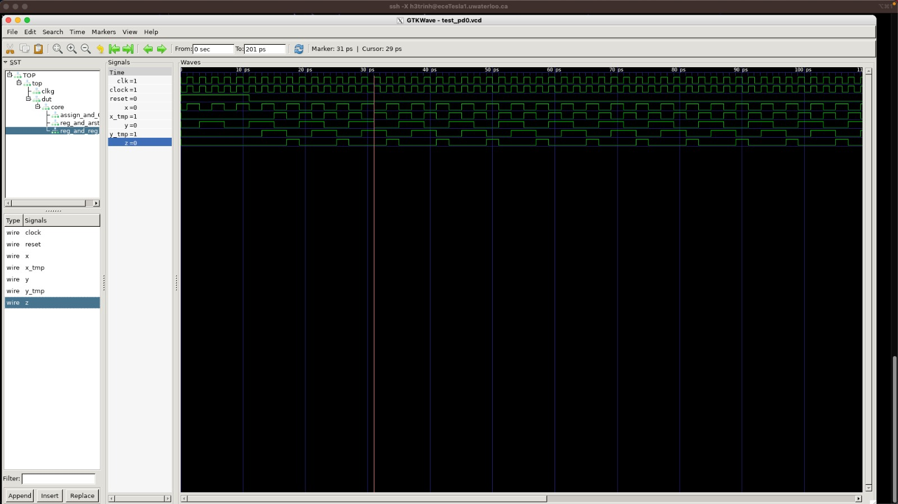

# RISC-V Design, Verification, and FPGA Flow

A 32-bit RV32I processor implemented in Verilog and developed incrementally from instruction memory and decode logic to a complete 5-stage pipelined core with forwarding, stalling, benchmark-driven verification, and FPGA deployment on the PYNQ-Z1.

## Why this project matters

This repository demonstrates an end-to-end digital design workflow: RTL construction, stage-wise microarchitecture integration, trace-based verification, benchmark execution, and FPGA-oriented redesign for memory inference and timing realism. The project was built progressively across multiple milestones, culminating in a pipelined RISC-V core that runs benchmark programs on hardware.

## Highlights

- 32-bit **RV32I** processor in **Verilog**
- Incremental implementation of **instruction memory, decode, register file, execute, memory, and writeback**
- Full **5-stage pipeline**: fetch, decode, execute, memory, writeback
- **RAW hazard handling** through **MX/WX/WM bypassing** and **stall insertion**
- **Trace-based verification** with **Verilator**
- **Benchmark execution** using RV32 instruction tests and simple programs
- **Vivado / xsim / PYNQ-Z1** deployment with **BRAM-aware memory redesign**

## Instruction Support

The decode stage extracts instruction fields, sign-extends immediates, and generates the control-relevant signals needed by later datapath stages.

<p align="center">
  
</p>

## Project Evolution

### PD0 - Environment setup and waveform-driven debugging
Established the Linux/Make/Verilator development flow, simulation scripts, and waveform inspection workflow used throughout the project.

<p align="center">
  
</p>

### PD1 - Instruction memory
Implemented a custom instruction memory with:
- **little-endian organization**
- program loading through **`readmemh()`**
- default PC start address at **`0x01000000`**
- **combinational reads** and **sequential writes**

This stage established the fetch path and benchmark-loading workflow for subsequent processor development.

### PD2 - Decode stage
Built a **combinational decode stage** that:
- splits the 32-bit instruction word into architectural fields
- extracts opcode / rd / rs1 / rs2 / funct3 / funct7 / immediates
- supports the required subset of RV32I instructions
- generates the values needed to drive later datapath components

### PD3 - Register file and execute stage
Implemented a synchronous **register file** with:
- 2 read ports and 1 write port
- combinational reads and sequential writes
- stack pointer (`x2`) initialization
- architectural register access for source/destination operands

Built the **execute stage** to perform:
- ALU arithmetic and logic operations
- branch comparison
- effective address computation
- **LUI** and **AUIPC** result generation

### PD4 - Memory and writeback stages
Completed the **single-cycle datapath** by adding:
- load/store support
- byte / half-word / word accesses
- **2-bit `access_size` memory interface**
- writeback selection from **ALU / memory / PC+4**

At this point, the processor could execute the provided RV32 benchmark suite end-to-end.

### PD5 - 5-stage pipelined processor
Extended the single-cycle core into a true pipelined microarchitecture with:
- distinct **fetch / decode / execute / memory / writeback** stages
- inter-stage pipeline registers
- **MX, WX, and WM bypassing**
- bypass support into the **branch comparator**
- **stall logic** for unresolved read-after-write hazards
- control of NOP insertion and structural hazard handling

### PD6 - FPGA deployment on PYNQ-Z1
Adapted the design for implementation on the **PYNQ-Z1 FPGA** using **Vivado 2022.1**:
- modified memory structures for **BRAM inference**
- updated the design to tolerate **1-cycle read latency**
- reworked the **register file** for FPGA memory mapping
- validated correctness using **post-synthesis** and **post-implementation** simulation in **xsim**
- executed benchmark programs on hardware

## Technical Scope

### Front-end and decode
- instruction fetch from custom instruction memory
- immediate extraction and sign extension
- instruction field decoding
- control-oriented signal generation

### Datapath and execution
- register file design
- ALU and branch comparator
- effective-address generation
- memory/load-store interface
- writeback selection logic

### Pipeline and hazards
- stage registers
- forwarding / bypassing
- branch comparator bypass support
- stall insertion for unresolved RAW hazards
- structural hazard handling

### Verification and tooling
- **Verilator** simulation
- stage-level **trace generation**
- comparison against provided golden traces
- benchmark validation with:
  - **individual instruction tests**
  - **simple programs**

### FPGA and implementation flow
- **Vivado 2022.1**
- **xsim** post-synthesis / post-implementation simulation
- **PYNQ-Z1** bring-up
- **BRAM inference**
- resource/timing-aware redesign

## Representative Engineering Decisions

### Instruction memory loading
The fetch path was built around benchmark loading from `.x` files, with memory initialized from hex input and the PC reset to the architectural start address.

```verilog
// Key design assumptions implemented in PD1
// - little-endian memory
// - PC starts at 0x01000000
// - benchmark image loaded with readmemh()
```